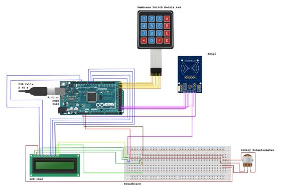

@settings {
  font-size: 100;
}

**Control d'acces par badge**

**Composant**

* Elegoo Mega 2560
* Membrane Switch Module 4x4
* RC522
* LCD 16x2
* BreadBoard
* Rotary Potentiometer
* Resistor 220Ω
* 
**Diagramme**

