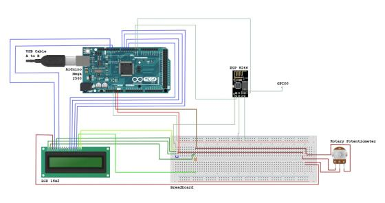

# Afficheur de message sur ecran LCD, client-serveur, modèle TCP/IP

Projet en cours...

**Composant**

* Elegoo Mega 2560
* Membrane Switch Module 4x4
* RC522
* LCD 16x2
* BreadBoard
* Rotary Potentiometer
* Resistor 220Ω

**Diagramme**

